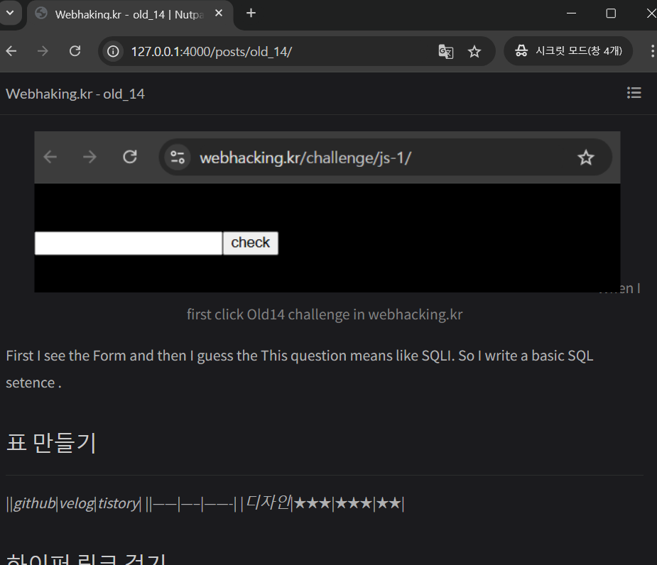

> Concepts to be used in this challenge
  JavaScript 
  Function IndexOf()

## Write Up
---
<p align="center" style="color:gray">
  
       When I first click Old14 challenge in webhacking.kr
</p>
First I see the Form and then I guess the This question means like SQLI. So I write a basic SQL setence . 




## 표 만들기
---
||_github_|_velog_|_tistory_| 
||------|-----|-------|
|_디자인_|★★★|★★★|★★|


## 하이퍼 링크 걸기 
---
[Ruby 다운로드 페이지](https://rubyinstaller.org/downloads/)  

## 사진 첨부
 
<p align="center" style="color:gray">
  
  홈 디렉토리가 존재하지 않는 모습
</p>

## 코드 첨부
```shell
$ gem install jekyll
$ gem install bundler
```                                                                                                                                                                                                                                                                       